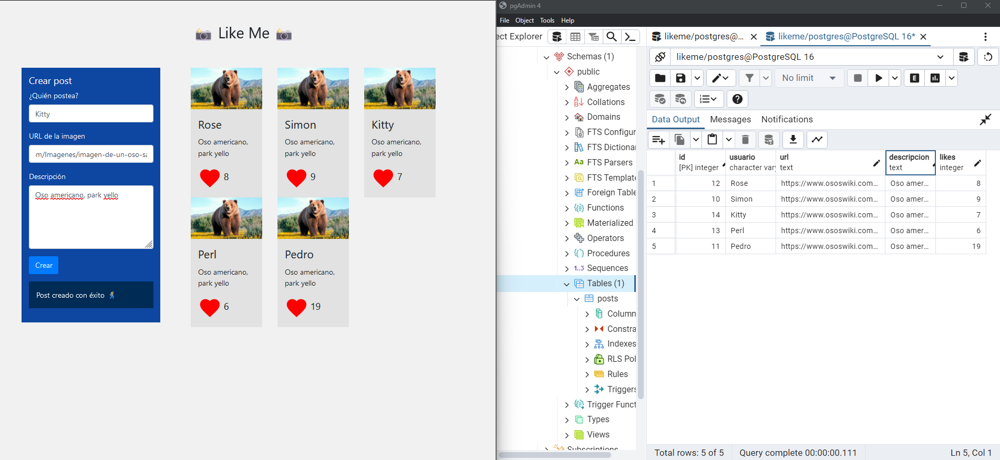

# Like-Me

# Descargar 
git clone https://github.com/siseveca79/Like-Me

# Correr en la terminal
npm install body-parser@^1.20.2 cors@^2.8.5 dotenv@^16.4.5 express@^4.19.2 pg@^8.11.5

# Crear DB

CREATE DATABASE likeme;

# Crear Tabla

CREATE TABLE posts (
  id SERIAL PRIMARY KEY,
  usuario VARCHAR(255) NOT NULL,
  url TEXT NOT NULL,
  descripcion TEXT NOT NULL,
  likes INTEGER DEFAULT 0
);

# Completar tus datos .env para tu local.

DB_USER=postgres
DB_HOST=localhost
DB_DATABASE=likeme
DB_PASSWORD=Simi1935
DB_PORT=5432

# Ejecutar el programa

node server.js

http://localhost:3000/

